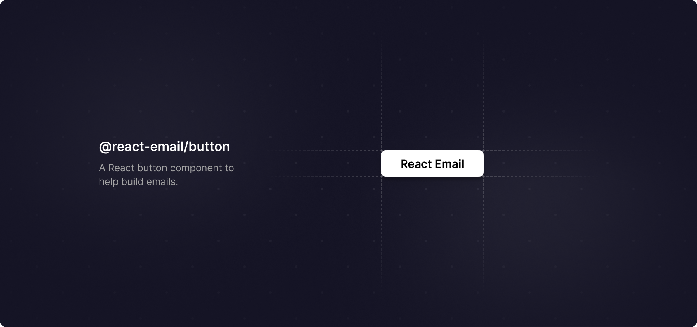

<div align="center"><strong>@react-email/button</strong></div>
<div align="center">A React button component to help build emails.</div>
<br />
<div align="center">
<a href="https://react.email">Website</a> 
<span> · </span>
<a href="https://react.email">Documentation</a> 
<span> · </span>
<a href="https://react.email">Twitter</a>
</div>

## Installation

#### With yarn

```sh
yarn add -E @react-email/button
```

#### With NPM

```sh
npm install --save-exact @react-email/button
```

## Getting Started

Add the `Button` to your app first.

```jsx
import { Button } from '@react-email/button';

const App = () => {
  return (
    <div>
      <Button href="https://react.email">Button</Button>
    </div>
  );
};
```

## Documentation

Find the full API reference on [official documentation](https://react.email).

## License

MIT License
