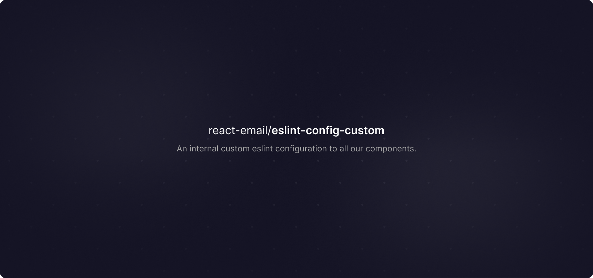

<strong>react-email/eslint-config-custom</strong>

An internal custom eslint configuration to all our components.

 

<a href="https://react.email">Website</a> 
 · 
<a href="https://react.email">Documentation</a> 
 · 
<a href="https://react.email">Twitter</a>

