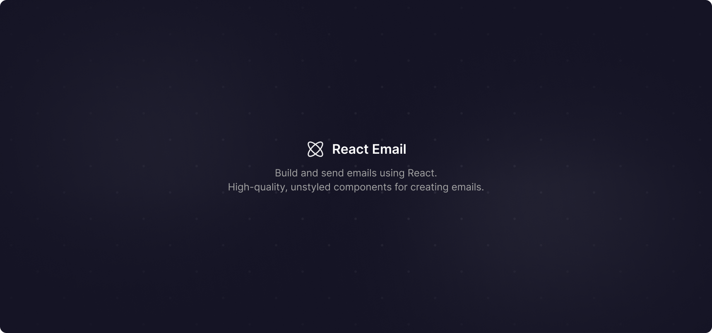

<strong>React Email</strong>

Build and send emails using React. High-quality, unstyled components for creating emails.

 

<a href="https://react.email">Website</a> 
 · 
<a href="https://react.email">Documentation</a> 
 · 
<a href="https://react.email">Twitter</a>

## Introduction

A collection of high-quality, unstyled components for creating beautiful emails using React and TypeScript.
It reduces the pain of coding responsive emails with dark mode support. It also takes care of inconsistencies between Gmail, Outlook, and other email clients for you.

## Why

We believe that email is an extremely important medium for people to communicate. However, we need to stop developing emails like 2010, and rethink how email can be done in 2022 and beyond. Email development needs a revamp. A renovation. Modernized for the way we build web apps today.

## Authors

- Bu Kinoshita ([@bukinoshita](https://twitter.com/bukinoshita))
- Zeno Rocha ([@zenorocha](https://twitter.com/zenorocha))
